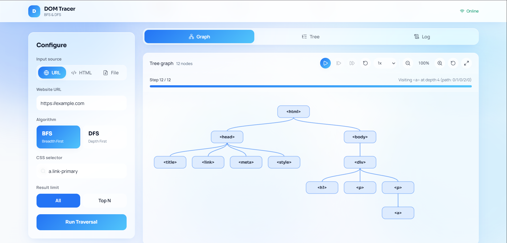

# DOMTracer



DOMTracer is a DOM traversal visualization application based on BFS and DFS algorithms for element searching using CSS selectors. The application consists of a Go backend for DOM parsing and traversal, and a React frontend for tree visualization, metrics, and traversal logs.

## Program Description

The program accepts HTML input (URL or raw HTML), parses it into a DOM tree, then performs node searching based on CSS selectors. Results are displayed in the following forms:

- Tree graph
- Step-by-step traversal list
- Performance metrics (search time, number of nodes visited, number of matches, depth)

## Project Structure

```text
.
|- backend/
|  |- cmd/server/           # Backend server entry point
|  |- src/parser/           # HTML parser & scraper
|  |- src/selector/         # CSS selector matcher
|  |- src/traversal/        # BFS/DFS traversal engine
|  |- Dockerfile
|  |- go.mod
|  \- Makefile
|- frontend/
|  |- src/                  # App bootstrap, api client, types
|  |- components/           # UI components
|  |- pages/                # Route pages
|  |- Dockerfile
|  \- package.json
|- docs/
|  |- public/               # Documentation image assets
|  \- ...
|- test/                    # Test cases HTML + expected outputs
|- docker-compose.yml
|- LICENSE
\- README.md
```

## Available Features

- Parse HTML into a DOM tree.
- Selector searching using BFS or DFS algorithm.
- Combinator selector support:
  - Descendant: `a b`
  - Child: `a > b`
  - Adjacent sibling: `a + b`
  - General sibling: `a ~ b`
- Simple selector support:
  - Tag: `div`
  - Class: `.container`
  - ID: `#header`
  - Universal: `*`
  - Tag + class: `div.container`
  - Multi-class: `.c1.c2`
  - Attribute: `[x=y]`, `a[x=y]`, `[attr]`
- Complex query support with multiple combinators, e.g. `div.container > ul.menu > li#item1[x=y]`.
- Visualization of traversal results and matched nodes.
- Result limit option (Top-N).

## Brief Explanation of BFS and DFS

- **BFS (Breadth-First Search)** traverses nodes level by level. All nodes at the same depth are examined before moving to the next depth.
- **DFS (Depth-First Search)** traverses as deep as possible along one branch, then backtracks to the next branch.

In this implementation, both algorithms evaluate the selector at every visited node. The key difference lies in the order of node visits, so the order of matches may differ even though the total number of matches is usually the same.

## Requirements

- Go 1.22+ (for backend)
- Node.js 18+ and npm (for frontend)
- Docker + Docker Compose (optional, for running via container)

## How To Run

### Using Docker

Run from the project root:

```bash
docker compose up --build
```

Access the application at:

- Frontend: http://localhost
- Backend API: http://localhost:8080

Stop the containers:

```bash
docker compose down
```

## Input File Format

Input files must be valid HTML documents (`.html` / `.htm`).

Example input file:

```html
<!DOCTYPE html>
<html>
    <body>
        <div class="container main" data-role="app">
            <ul class="menu primary">
                <li id="home" data-kind="nav">Home</li>
                <li data-kind="nav">About</li>
            </ul>
            <ol>
                <li id="ordered">Ordered</li>
            </ol>
        </div>
    </body>
</html>
```

Example complex selector query for testing:

```css
div.container.main[data-role=app] > ul.menu.primary > li#home[data-kind=nav]
```

## Testing

Run all unit tests:

```bash
go test ./... -v
```

Backend endpoint documentation and usage examples are available in [docs/api.md](docs/api.md).

## Team Members

| Name                          | Student ID |
|-------------------------------|------------|
| Moh. Hafizh Irham Perdana     | 13524025   |
| Aufa Rienaldifaza Ahmad       | 13524027   |
| Muhammad Aufar Rizqi Kusuma   | 13524061   |

## License

This project is licensed under the MIT License. Full details are available in the [LICENSE](LICENSE) file.